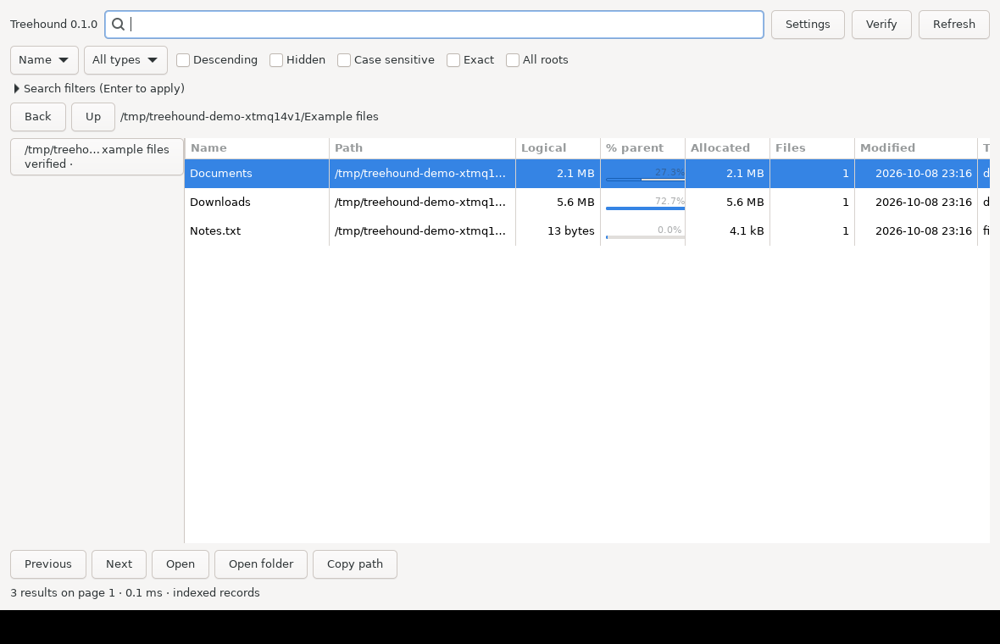

# Treehound

Native Linux disk-usage browsing and indexed filename/path search, written in C17 with GTK4 and SQLite FTS5. MIT licensed.

**v0.1 foundation:** persistent indexing, asynchronous GTK explorer/search, CLI and live inotify updates. Native DEB/RPM install, reinstall, GUI/CLI smoke and removal gates have passed in Debian 13 and Fedora 44. Treemap, history and large-filesystem performance verification follow in the roadmap.

[Latest release](https://github.com/blindicide/treehound/releases/latest) · [DEB](https://github.com/blindicide/treehound/releases/latest/download/treehound_0.1.0_amd64.deb) · [RPM](https://github.com/blindicide/treehound/releases/latest/download/treehound-0.1.0-1.x86_64.rpm)



[Build instructions](docs/BUILDING.md) · [Architecture](docs/ARCHITECTURE.md) · [Database](docs/DATABASE.md) · [GitHub Actions](https://github.com/blindicide/treehound/actions)

```sh
treehoundd                  # unprivileged daemon, default root: home
treehound                   # GTK explorer/search
treehound search 'report' --json
treehound search '*.pdf' --under /home/user/Documents --sort size --descending
treehound search 'report.pdf' --exact --case-sensitive
treehound search 'report' --extension pdf --min-size 1MiB --after 7d
treehound roots --json
treehound verify --wait
treehound status
```

Search reads the persistent database, never recursively traverses the live filesystem. Results retain cached consistency states during reconciliation. The GUI offers type, extension, size and modification-time filters; case/hidden controls; sorting; bounded 200-row pages; usage bars; navigation; and open/open-folder/copy-path actions. Enter applies advanced filters. Invalid filename bytes remain intact in the database and JSON uses surrogate escapes; GTK displays replacement characters. Copy-path currently copies that display form for invalid UTF-8 paths.

Configuration: `$XDG_CONFIG_HOME/treehound/treehound.conf` (default `~/.config/treehound/treehound.conf`). Database: `$XDG_STATE_HOME/treehound/index.sqlite3`. Socket: `$XDG_RUNTIME_DIR/treehound/treehoundd.sock`. Example:

```ini
root = /home/user
exclude = .cache
watch = true
cross_mounts = false
reconcile_interval_hours = 24
```

Allocated size means `st_blocks * 512`, not unique physical storage. Compression, reflinks and shared extents may make totals differ from filesystem tools. Hard-link pathnames remain searchable; directory aggregation deduplicates inodes. Mount crossing and symlink traversal are disabled by default. No system-wide watch limits are changed.

The Settings editor validates and atomically saves daemon configuration, then reconciles changed roots/exclusions. Changing `watch` requires a daemon restart. `background_service` records intent; enable the installed user service explicitly with `systemctl --user enable --now treehound.service`. GUI filter/sort preferences persist in `gui.conf`. Refresh updates root states; active initial scans refresh automatically.
